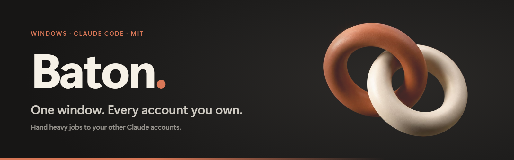
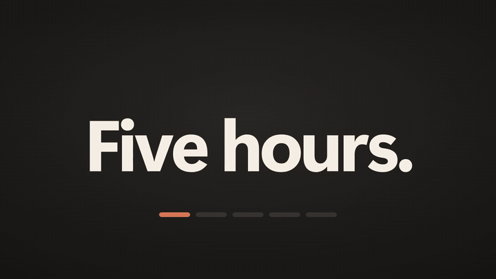
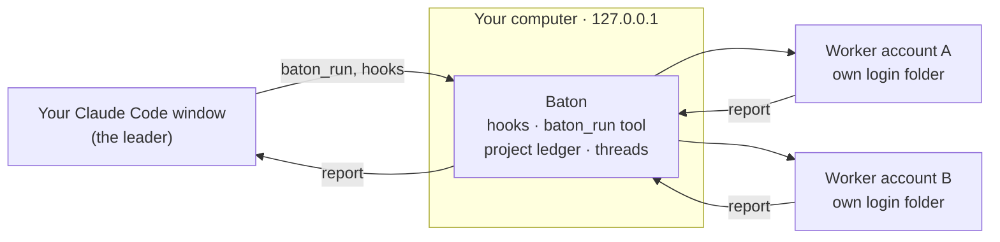
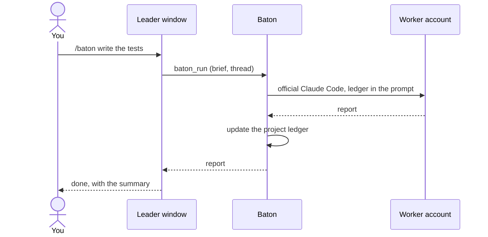
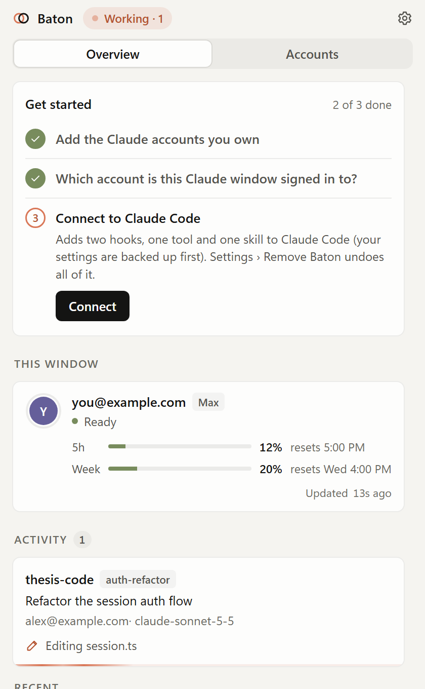
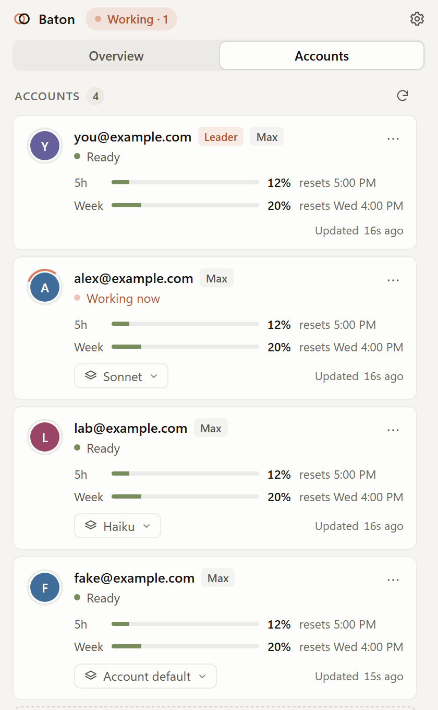
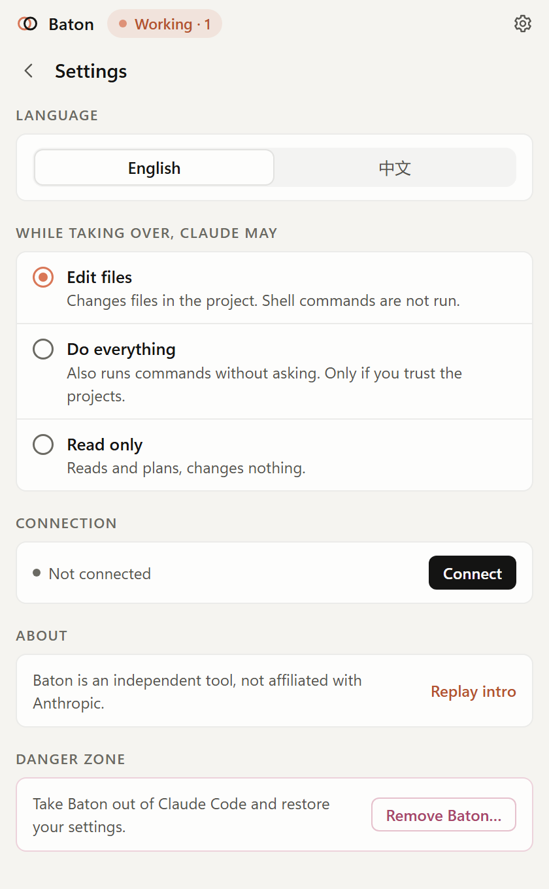

<div align="center">



### **One window. Every account you own.**

Baton lets your Claude Code window hand heavy jobs to your *other* Claude accounts.<br>
Each one runs the official client under its own login, and remembers what it did.

[](https://github.com/zhenggao-30/baton/releases/latest)
[](LICENSE)
[](#download)
[](https://github.com/zhenggao-30/baton/actions/workflows/test.yml)
[](https://github.com/zhenggao-30/baton/stargazers)

**[Download](#download)** &nbsp;·&nbsp; **[Website](https://zhenggao-30.github.io/baton/)** &nbsp;·&nbsp; **[Film](https://zhenggao-30.github.io/baton/#film)** &nbsp;·&nbsp; **[Docs](#how-it-works)** &nbsp;·&nbsp; **[中文](README.zh-CN.md)**

<a href="https://zhenggao-30.github.io/baton/#film"></a>

<sub>Click the preview to watch the 48-second film.</sub>

</div>

<br>

## Download

<div align="center">

[](https://github.com/zhenggao-30/baton/releases/latest/download/Baton-Setup.exe)
&nbsp;
[](https://github.com/zhenggao-30/baton/releases/latest/download/Baton-portable.exe)

</div>

**Baton-Setup.exe** installs for your Windows user and adds a Start menu shortcut. **Baton-portable.exe** runs without installing. Neither is code-signed yet, so SmartScreen may say "unknown publisher": click **More info**, then **Run anyway**. Baton is open source; read it or [build it yourself](#build-from-source).

## Why Baton

Your best work window is tied to a single account, and that account's usage is finite. Baton keeps that window as the *leader* and hands heavy, self-contained jobs to the other accounts you own, the *workers*, each running the official Claude Code under its own login. You keep one conversation, the heavy work runs on the workers' usage, and nothing about how you sign in changes.

## Features

<table>
<tr>
<td width="50%" valign="top"><b>Dispatch</b><br>Say <code>/baton</code>. A worker account takes the job and reports back.</td>
<td width="50%" valign="top"><b>Memory</b><br>Named threads resume the same session; a project ledger tells each worker what the others did.</td>
</tr>
<tr>
<td valign="top"><b>Usage at a glance</b><br>Every account's 5-hour and weekly usage, and when each resets.</td>
<td valign="top"><b>A model per account</b><br>Set a default such as <code>haiku</code> for each account's worker runs.</td>
</tr>
<tr>
<td valign="top"><b>Parallel jobs and queues</b><br>Different accounts work at once; one project folder is never written by two jobs.</td>
<td valign="top"><b>Safety net</b><br>If the leader hits a limit mid-task, a worker continues the same session in the background.</td>
</tr>
<tr>
<td valign="top"><b>Private and local</b><br>Everything listens on <code>127.0.0.1</code>. Baton never touches your credentials.</td>
<td valign="top"><b>Clean uninstall</b><br>One click, or the Windows uninstaller, removes Baton's wiring from Claude Code.</td>
</tr>
<tr>
<td valign="top" colspan="2"><b>English and Chinese</b><br>The panel and the website switch between both languages.</td>
</tr>
</table>

## How it works





## See it

<table>
<tr>
<td width="33%" align="center"><br><sub><b>Overview</b><br>The job, its progress, every account.</sub></td>
<td width="33%" align="center"><br><sub><b>Accounts</b><br>Usage, resets and a model each.</sub></td>
<td width="33%" align="center"><br><sub><b>Settings</b><br>Connect, undo, uninstall.</sub></td>
</tr>
</table>

## Quick start

1. **Add your other accounts.** In the panel, add each Claude account you own and sign in to it once. Each gets its own Claude Code login folder, separate from your main login.
2. **Connect.** Click **Connect**. Baton adds two hooks, one tool and one skill to Claude Code, and backs up your settings first.
3. **Open a new Claude Code session** (an open one won't pick up the change) and say `/baton <job>`, or just "use baton for this".
4. **Watch the panel.** It shows the job and its progress, and each account's usage.

## Privacy and safety

- [x] Never reads, copies or sends your Claude credentials
- [x] Sign-in only through Claude Code's own flow (`claude auth login`); tokens stay in each account's own folder
- [x] The Claude Code binary is not modified, and no API traffic is proxied
- [x] Local only: the panel, its API and the hooks listen on `127.0.0.1`, and Baton sends nothing anywhere
- [x] One-click undo (Settings, Danger zone, *Remove Baton*) and a clean Windows uninstall
- [x] Saved sign-ins are kept unless you tick the box to delete them

> [!NOTE]
> **Good to know**
> - Baton is an independent tool, not made by or affiliated with Anthropic; it works with Claude Code.
> - Each account's usage limits and terms still apply: the [Consumer Terms](https://www.anthropic.com/legal/consumer-terms) and [Usage Policy](https://www.anthropic.com/legal/aup), and your organisation's terms for a Team or Enterprise seat. Baton changes no account's limits.
> - Use only accounts you own, and never share a login. Baton does not pool one login's usage; each worker runs the official client under its own login.
> - Built and tested on Windows 11. The macOS (`dmg`) and Linux (`AppImage`) targets are configured but untested.

> [!WARNING]
> **Not verified yet**
> - A real plan-limit event. The failover path is tested with simulated limit events and with real accounts, but no real limit has hit it yet.
> - Clean PCs and Windows 10. The installer and uninstaller were run once, silently, on the machine they were built on (Windows 11).
> - Code signing. The files are unsigned (see [Download](#download)).

<details>
<summary><b>Under the hood</b></summary>

- **Leader and workers.** The account of the window you are in is the leader. A worker account runs the official Claude Code on the job and hands back a report.
- **Threads and a ledger.** Workers can't see your conversation, so Baton passes the dispatcher's written brief, a **named thread** per line of work (the same worker session is resumed, even if Baton moved it to another account) and a **project ledger** of what every worker did. The ledger is added to the next worker's prompt, and the leader can read it with `baton_ledger`. Workers also get your shared `CLAUDE.md` files and project memory.
- **Usage.** 5-hour and weekly usage come from Claude Code's own `/usage`.
- **The leader follows you.** The desktop app puts the signed-in e-mail in every session; when you switch this window to another pooled account, Baton notices and updates the leader.
- **Safety net.** If the leader hits a limit mid-task, Baton continues the same session on a worker in the background (with `--resume`) and tells you when it's done.
- **Queues.** Jobs for the same project folder queue first come, first served.
- **What Connect changes.** Two hooks in your Claude Code settings (`StopFailure` for plan limits, `SessionStart` to learn who is signed in), an MCP server named `baton` registered with `claude mcp add --scope user`, and a skill in `~/.claude/skills/baton`. Settings are backed up first and only Baton's own entries are touched.
- **MCP tools.** `baton_run`, `baton_status`, `baton_ledger`.

</details>

<details>
<summary><b>Build from source</b></summary>

You need Node.js (CI uses Node 22).

```bash
npm install
npm test                  # engine, takeover, hooks, workers, MCP protocol, connect/remove (fake `claude`)
node src/dev.js --demo    # the panel in a browser with throwaway demo accounts
npm start                 # the tray app
node src/cli.js           # terminal: add / login / list / connect / disconnect / remove-all
npm run dist              # Windows installer and portable exe, written to dist/
```

If `npm run dist` fails with `EPERM` when electron-builder renames a file, build into a folder that sync tools and virus scanners don't watch:

```bash
npm run dist -- -c.directories.output=C:/baton-build/dist
```

</details>

<details>
<summary><b>Project layout</b></summary>

- `src/core`: account store, limit detection and failover engine, usage reader, project memory (threads, ledger, locks), worker runner, hook and connect installers.
- `src/mcp.js`: the MCP server. `src/server.js`: the local API for the panel and the hooks.
- `ui/`: the panel. `src/main.js`: the Electron tray shell.
- `test/fake-claude.js` stands in for `claude`, so every test scenario runs without using any quota.

</details>

## Contributing

Bug reports, ideas and pull requests are welcome. Read [CONTRIBUTING.md](CONTRIBUTING.md) first; report security problems privately via [SECURITY.md](SECURITY.md).

## Contributors

<table>
  <tr>
    <td align="center" width="140">
      <a href="https://github.com/ZhengGao-30"><br><sub><b>ZhengGao-30</b></sub></a><br><sub>Author and maintainer</sub>
    </td>
    <td align="center" width="140">
      <a href="https://github.com/catRiceY"><br><sub><b>catRiceY</b></sub></a>
    </td>
    <td align="center" width="140">
      <a href="https://github.com/JiaojiaoSwin"><br><sub><b>JiaojiaoSwin</b></sub></a>
    </td>
  </tr>
</table>

Everyone who has helped is listed in [CONTRIBUTORS.md](CONTRIBUTORS.md). Want to be on this list? Open a pull request.

## License

[MIT](LICENSE). Copyright (c) 2026 ZhengGao-30.
