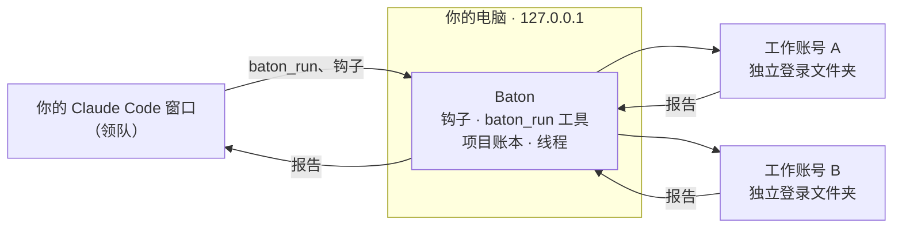
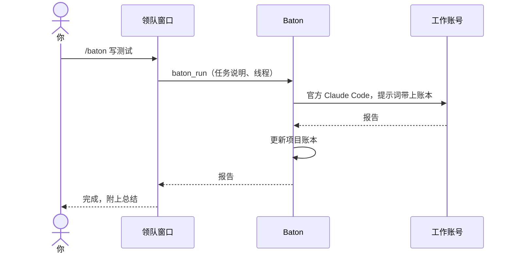

<div align="center">


### **一个窗口，调用你拥有的每一个账号。**

Baton 让你的 Claude Code 窗口把重活交给你*其他*的 Claude 账号。<br>
每个账号都用自己的登录运行官方客户端，并记得自己做过什么。

[](https://github.com/zhenggao-30/baton/releases/latest)
[](LICENSE)
[](#下载)
[](https://github.com/zhenggao-30/baton/actions/workflows/test.yml)
[](https://github.com/zhenggao-30/baton/stargazers)

**[下载](#下载)** &nbsp;·&nbsp; **[网站](https://zhenggao-30.github.io/baton/)** &nbsp;·&nbsp; **[短片](https://zhenggao-30.github.io/baton/#film)** &nbsp;·&nbsp; **[文档](#工作原理)** &nbsp;·&nbsp; **[English](README.md)**

<a href="https://zhenggao-30.github.io/baton/#film"></a>

<sub>点击预览，观看 48 秒短片。</sub>

</div>

<br>

## 下载

<div align="center">

[](https://github.com/zhenggao-30/baton/releases/latest/download/Baton-Setup.exe)
&nbsp;
[](https://github.com/zhenggao-30/baton/releases/latest/download/Baton-portable.exe)

</div>

**Baton-Setup.exe** 装在当前 Windows 用户下，并在开始菜单放一个快捷方式；**Baton-portable.exe** 免安装，直接运行。两者目前都还没有代码签名，SmartScreen 可能提示"未知发布者"：点 **更多信息**，再点 **仍要运行**。Baton 是开源的，你可以自己读代码，或者[从源码构建](#从源码构建)。

## 为什么需要 Baton

你最好用的那个工作窗口只绑着一个账号，而这个账号的额度是有限的。Baton 让这个窗口继续当*领队*，把重的、能独立完成的活交给你拥有的其他账号，也就是*工作账号*，每个都用自己的登录运行官方 Claude Code。你始终只有一场对话，重活用工作账号的额度去跑，登录方式没有任何改变。

## 功能

<table>
<tr>
<td width="50%" valign="top"><b>派发</b><br>说一句 <code>/baton</code>，工作账号接手任务，做完把报告交回来。</td>
<td width="50%" valign="top"><b>记忆</b><br>命名线程接着同一个会话继续；项目账本让每个工作账号知道其他账号做过什么。</td>
</tr>
<tr>
<td valign="top"><b>一眼看清额度</b><br>每个账号的 5 小时和每周额度，以及何时重置。</td>
<td valign="top"><b>每个账号单独选模型</b><br>为每个账号的工作任务设默认模型，比如 <code>haiku</code>。</td>
</tr>
<tr>
<td valign="top"><b>并行与排队</b><br>不同账号同时干活；同一个项目文件夹绝不会被两个任务同时写。</td>
<td valign="top"><b>安全网</b><br>领队中途碰到上限，工作账号在后台接着同一个会话做完。</td>
</tr>
<tr>
<td valign="top"><b>私密，只在本机</b><br>一切只监听 <code>127.0.0.1</code>，Baton 从不碰你的凭据。</td>
<td valign="top"><b>干净卸载</b><br>一键撤销，或者用 Windows 卸载程序，都会清除 Baton 接入 Claude Code 的部分。</td>
</tr>
<tr>
<td valign="top" colspan="2"><b>中文和英文</b><br>面板和网站都可以在两种语言之间切换。</td>
</tr>
</table>

## 工作原理





## 界面

<table>
<tr>
<td width="33%" align="center"><br><sub><b>总览</b><br>任务、进度、每个账号。</sub></td>
<td width="33%" align="center"><br><sub><b>账号</b><br>额度、重置时间、各自的模型。</sub></td>
<td width="33%" align="center"><br><sub><b>设置</b><br>连接、撤销、卸载。</sub></td>
</tr>
</table>

## 快速开始

1. **添加你的其他账号。** 在面板里添加你拥有的每个 Claude 账号，并各登录一次。每个账号都有自己单独的 Claude Code 登录文件夹，和你平时的登录互不影响。
2. **点击"连接"。** Baton 会向 Claude Code 添加两个钩子、一个工具和一个技能，并先备份你的设置。
3. **打开一个新的 Claude Code 会话**（已打开的会话不会生效），输入 `/baton <任务>`，或者直接说"用 baton 来做这个"。
4. **看面板。** 它会显示任务和进度，以及每个账号的额度。

## 隐私与安全

- [x] 从不读取、复制或发送你的 Claude 凭据
- [x] 登录只走 Claude Code 自己的流程（`claude auth login`），令牌留在各账号自己的文件夹里
- [x] 不修改 Claude Code 本身，也不转发任何 API 流量
- [x] 只在本机运行：面板、本地接口和钩子都只监听 `127.0.0.1`，Baton 不会把任何内容发到别处
- [x] 一键撤销（设置，"危险操作"，*Remove Baton*），Windows 卸载也很干净
- [x] 已保存的登录默认保留，除非你主动勾选删除

> [!NOTE]
> **需要知道的事**
> - Baton 是独立工具，不是 Anthropic 制作的，也与 Anthropic 没有隶属关系；它与 Claude Code 配合使用。
> - 每个账号的额度限制和使用条款依然适用：[Consumer Terms](https://www.anthropic.com/legal/consumer-terms) 和 [Usage Policy](https://www.anthropic.com/legal/aup)；Team 或 Enterprise 席位还要遵守你所在机构的条款。Baton 不会改变任何账号的额度。
> - 只使用你自己拥有的账号，绝不共享登录。Baton 不会汇集一个登录的额度；每个工作账号都用自己的登录运行官方客户端。
> - 在 Windows 11 上构建和测试。macOS（`dmg`）和 Linux（`AppImage`）的打包配置已写好，但没有测试过。

> [!WARNING]
> **尚未验证**
> - 真正遇到一次套餐额度上限。故障转移已用模拟的额度事件和真实账号测试过，但还没有真实的额度上限触发过它。
> - 干净的电脑和 Windows 10。安装程序和卸载程序只在构建它们的那台电脑（Windows 11）上静默运行过一次。
> - 代码签名。这些文件没有签名（见[下载](#下载)）。

<details>
<summary><b>技术细节</b></summary>

- **领队与工作账号。** 你所在窗口的账号就是领队。工作账号运行官方 Claude Code 完成任务，再把报告交回来。
- **线程与账本。** 工作账号看不到你的对话，所以 Baton 会交给它：调度方写的任务说明；每条工作线路一个**命名线程**（同一个工作会话会接着继续，即使 Baton 把它换到了另一个账号）；以及一份**项目账本**，记录每个工作账号做过什么。账本会加进下一个工作账号的提示词，领队也可以用 `baton_ledger` 读取。工作账号还能读到你共享的 `CLAUDE.md` 和项目记忆。
- **额度。** 5 小时和每周额度来自 Claude Code 自己的 `/usage`。
- **领队跟着你走。** 桌面版会在每个会话里带上登录的邮箱；你把这个窗口切到账号池里的另一个账号，Baton 会发现并更新领队。
- **安全网。** 领队中途碰到上限，Baton 会在后台用 `--resume` 把同一个会话交给工作账号接着做，完成后通知你。
- **排队。** 同一个项目文件夹的任务先来先做。
- **"连接"改了什么。** Claude Code 设置里多两个钩子（`StopFailure` 处理套餐额度用尽，`SessionStart` 得知当前登录的是谁）；用 `claude mcp add --scope user` 注册名为 `baton` 的 MCP 服务；在 `~/.claude/skills/baton` 放一个技能。改动前先备份设置，只动 Baton 自己的条目。
- **MCP 工具。** `baton_run`、`baton_status`、`baton_ledger`。

</details>

<details>
<summary><b>从源码构建</b></summary>

需要 Node.js（CI 使用 Node 22）。

```bash
npm install
npm test                  # 引擎、接管、钩子、工作账号、MCP 协议、连接/移除（使用假的 `claude`）
node src/dev.js --demo    # 在浏览器里打开面板，使用一次性的演示账号
npm start                 # 托盘应用
node src/cli.js           # 终端命令：add / login / list / connect / disconnect / remove-all
npm run dist              # Windows 安装程序和免安装版，输出到 dist/
```

如果 `npm run dist` 在 electron-builder 重命名文件时报 `EPERM`，把输出目录换到不被同步工具或杀毒软件监视的文件夹：

```bash
npm run dist -- -c.directories.output=C:/baton-build/dist
```

</details>

<details>
<summary><b>项目结构</b></summary>

- `src/core`：账号存储、额度检测与故障转移引擎、用量读取、项目记忆（线程、账本、锁）、工作账号运行器，以及钩子和连接的安装程序。
- `src/mcp.js`：MCP 服务。`src/server.js`：面板和钩子使用的本地接口。
- `ui/`：面板。`src/main.js`：Electron 托盘外壳。
- `test/fake-claude.js` 代替 `claude` 运行，所以每个测试场景都不消耗额度。

</details>

## 参与贡献

欢迎提交问题、想法和 Pull Request。请先阅读 [CONTRIBUTING.md](CONTRIBUTING.md)；安全问题请按 [SECURITY.md](SECURITY.md) 私下报告。

## 贡献者

<table>
  <tr>
    <td align="center" width="140">
      <a href="https://github.com/ZhengGao-30"><br><sub><b>ZhengGao-30</b></sub></a><br><sub>作者与维护者</sub>
    </td>
    <td align="center" width="140">
      <a href="https://github.com/catRiceY"><br><sub><b>catRiceY</b></sub></a>
    </td>
    <td align="center" width="140">
      <a href="https://github.com/JiaojiaoSwin"><br><sub><b>JiaojiaoSwin</b></sub></a>
    </td>
  </tr>
</table>

所有帮助过这个项目的人都列在 [CONTRIBUTORS.md](CONTRIBUTORS.md) 里。想加入这个名单？欢迎提交 Pull Request。

## 许可证

[MIT](LICENSE)。版权所有 (c) 2026 ZhengGao-30。
